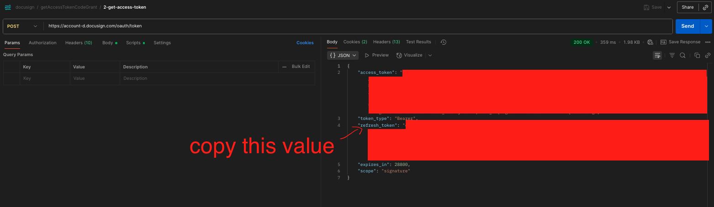
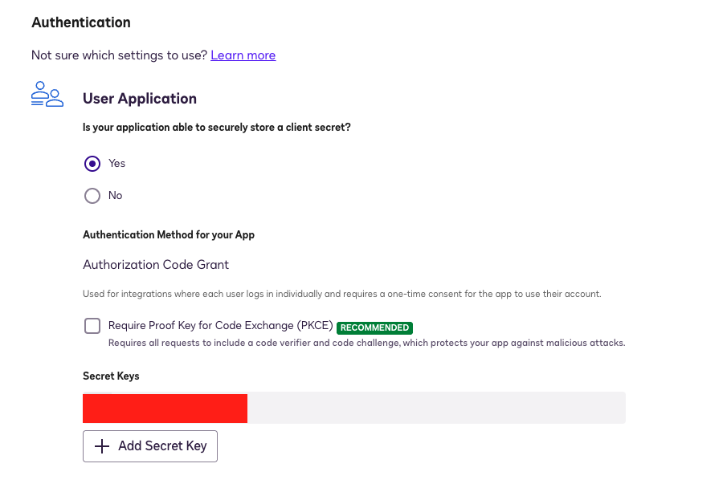

# DOCUSIGN

## Init project

npm i
npm run make-env
npx playwright install

## GET DS_REFRESH_TOKEN

for the environment add the respective values

"key": "e_docuSign_client_id" = DS_INTEGRATION_KEY
"key": "e_docuSign_api_account_id" = DS_API_ACCOUNT_ID
"key": "e_docuSign_basic_auth" = DS_BASIC_AUTH

In the postman collection

- [make the step 1](#step-1)
- [make the step 2](#step-2) from the response take the refresh token value and set in on `DS_REFRESH_TOKEN` env variable 

## DOCUSIGN CONFIG

- Create a DocuSign developer account
- create/add the app and integration key

here is a more detailed example https://www.youtube.com/watch?v=FO5szVDu7PE&ab_channel=DocusignDevelopers
- you must set an environment with the following variables:
    - e_docuSign_client_id: is the integration key of the app this also called "Client Id"
    - e_docuSign_api_account_id: you can find this value in apps-and-keys module, "My Account Information" section => "API account id"
    - e_docuSign_basic_auth: is the base64 of Integration-Key:Secret Key, then, from the app created in docuSign/apps-and-keys take the respective integration Key or Client Id, for the Secret Key, enter to the app and generate the respect secret-key

- in the app settings, add redirects URIs (whatever URI), ex:

for the simple exercise as Redirect URI was set the localhost then when you execute the first step or first request in the browser, you should take the code generated: Here is a more detailed example (min 4:05) https://www.youtube.com/watch?v=4cn7Mvmq0Lo&ab_channel=DocusignDevelopers

## CONSUME DOCUSIGN SERVICES

### STEP 1

so, in the collection go to the folder "getAccessTokenCodeGrant" go to requests "1-oauth-get-code-for-access-token" copy the url and replace {{e_docuSign_client_id}} with the respective value, in the browser executes the url and when this run will redirect you to the redirect URI that you set previously, result expected:

copy the code generated, and in the collection, go to pre-request a paste the code in the collection variable "c_docuSign_code"

the previous step should be executed only the first time that you import the collection cause once you execute the step 2 you will have access token and refresh token and with this last you can generate the access token with the request "M-refresh-token"

### STEP 2

execute the request "2-get-access-token" this will set access_token and refresh_token as collection variables automatically

### STEP 3
you can run "3-get-user-info" or "3-get-brands" which are requests to confirm the access_token works, then if this work you can consume other services:

When access_token expires, you can run "M-refresh-token" to refresh the tokens, this requests will also set the tokens

### SEND ENVELOPES FOR SIGNATURE
this is the order of execution requests to generate the url to sign documents
- send-envelopes: send envelopes to the respective singers defined
- update-envelope: update the envelop with clientUserId for all signers
- embeded-signing: generate the url to copy and sing the document, must be execute once per signer defined in the envelop (send-envelopes), the info must match with the info submitted in previous requests

get-signing-status: check the envelop status, once the all documents have been signed the status should be completed

get-recipients: Check signature status

these services use to update info of recipients and envelope, but cannot change the status to completedupdate-recipientsupdate-envelope

## Playwright

- npx playwright test --ui #run playwright UI
- npx playwright test tests-examples #headless
- npx playwright test tests-examples --headed #UI